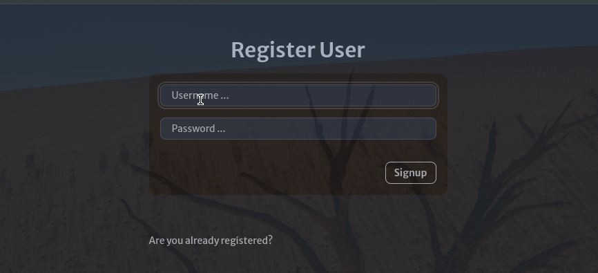

<div align="center">

# elixir_jwt_auth_protected_route

#### Demo web app with Plug, Bandit, Joken and Htmx, with JWT authentication of protected routes (no Phoenix).

<br />



<br /><br />

   

</div>

<br />

---

### 🚀 Features

  - [x] Authentication using [`Json Web Token`](https://www.jwt.io/) established in a `cookie` whose duration we have set to 60s (the same as the expiration time of the `JWT`) only for educational purposes, although it can be modified to more realistic values. We used the [`Joken`](https://hexdocs.pm/joken/readme.html) library to generate and sign the token, as well as to validate it, as it allows for easy configuration and use.

  - [x] Two `middlewares` (or [`plugs`](https://hexdocs.pm/plug/readme.html#plugs-and-the-plug-conn-struct), in [Elixir terminology](https://yuriktech.com/2019/07/03/Authentication-Middleware-In-Elixir/)) have been created. One of them (`lib/elixir_jwt_auth_protected_route/web/user/auth.ex`) handles accessibility to the protected page of the application, verifying the access token (if any) and setting the current user, if applicable, in the `assigns` field of the [`%Plug.Conn{}`](https://hexdocs.pm/plug/Plug.Conn.html) structure, which represents the connection that travels through the plug pipeline through which the servers are implemented in the Elixir world. The other `plug` or `middleware` (`lib/elixir_jwt_auth_protected_route/web/user/message.ex`) intercepts the connection to check if the authentication route controller has set a temporary cookie with the message to be displayed (the cookie contains a `base64` encoded map with the message itself and its type). If applicable, it inserts the message and its type in the `assigns` field and passes the `Conn` structure to the route expected by the controller.

  - [x] The minimalist yet interactive UI is achieved through the JS library [`Htmx`](https://htmx.org/) (and minimal use of [`Hyperscript`](https://hyperscript.org/) for automatic Flash message removal). The use of `Htmx` is very useful with the template engines of backend languages, as it allows for the creation of lightweight yet fully interactive web applications without having to resort to frameworks as good as, but "heavyweight" as, `Phoenix`. (See the considerations I make [here](https://github.com/emarifer/elixir_htmx_plug_bandit_todoapp) on this subject.)

### 👨‍🚀 Getting Started:

  - <ins>Prerequisites:</ins> Obviously, you'll need to install [`Elixir`](https://elixir-lang.org/install.html) and [`Erlang/OTP`](https://www.erlang.org/) (because you'll need to use its virtual machine). I recommend doing this through [`asdf`](https://asdf-vm.com/guide/getting-started.html). This will allow you to have multiple versions of Elixir installed and easily switch between them per project or set a global version for the system. Likewise, `asdf` will also allow you to install `NodeJS` (and, similarly, manage its different versions), which is required to install the `Tailwind CSS` and `daisyUI` JavaScript packages.
    
    >***I advise you to follow the recommendations made [here](https://github.com/emarifer/elixir-desktop-todoapp?tab=readme-ov-file#prerequisites) to create a more complete Erlang/OTP installation that will give you more options when developing with Elixir/Erlang.***

  - <ins>Usage:</ins> Clone the repository and run the following command in a terminal at the project root. This command installs the JS dependencies, generates the CSS in the `priv/static/assets/css/` directory, installs the Elixir dependencies, creates the `Sqlite3` database, and runs the migrations on that database:

    ```
    $ mix setup
    ```

    You can now start the `Bandit` server with:

    ```
    $ mix run --no-halt
    ```

    Or if you want, use the Elixir shell (IEx):

    ```
    $ iex -S mix
    ```

    Now, if you visit the address `http://localhost:4000` in your browser you will be redirected to   `http://localhost:4000/auth/register` automatically and use the application.

    Alternatively, you can pass an environment variable to either of the above 2 commands that  specifies a different listening port:

    ```
    $ PORT=5000 mix run --no-halt
    ```

    Finally, you can compile the application for production as an `Elixir release`, which will include everything the application needs to run in a single folder: the `runtime`, the `BEAM VM`, the resulting binaries, and even the `assets`. Before doing so, however, you'll need to modify the application's configuration to adapt it to your specific requirements. You can find the documentation on this [here](https://hexdocs.pm/mix/Mix.Tasks.Release.html) and [here](https://hexdocs.pm/elixir/config-and-releases.html).

    >***<ins>Note:</ins> I've added the [`ExSync`](https://hexdocs.pm/exsync/readme.html) library (<ins>dev mode only</ins>) that enables `hot reloading` when you make code changes in your editor and save it. While editing, you'll need to have two terminals open, one running `npm run watch-css` to monitor changes to CSS in your `.html.eex` template files with `Tailwind CSS`, and the other running Elixir's `Bandit` server (`mix run --no-halt`). Of course, you'll need to reload your browser to see these changes in the UI.***


---

### 📚 Learn more

  - Official website: https://elixir-lang.org/
  - Elixir Docs: https://hexdocs.pm/elixir/introduction.html
  - Elixir School: https://elixirschool.com/
  - Elixir Forum: https://elixirforum.com/
  - Ecto: https://hexdocs.pm/ecto/3.13.3/getting-started.html
  - Ecto SQL: https://hexdocs.pm/ecto_sql/Ecto.Adapters.SQL.html
  - Ecto (Phoenix Guide): https://hexdocs.pm/phoenix/ecto.html
  - Plug: https://hexdocs.pm/plug/readme.html
  - Bandit: https://hexdocs.pm/bandit/Bandit.html
  - Joken: https://hexdocs.pm/joken/readme.html
  - JWT Auth in Elixir with Joken: https://elixirschool.com/blog/jwt-auth-with-joken
  - Authentication Middleware in Elixir: https://yuriktech.com/2019/07/03/Authentication-Middleware-In-Elixir/
  - Htmx: https://htmx.org/
  - Hyperscript: https://hyperscript.org/

---

### Happy coding 😀!!

